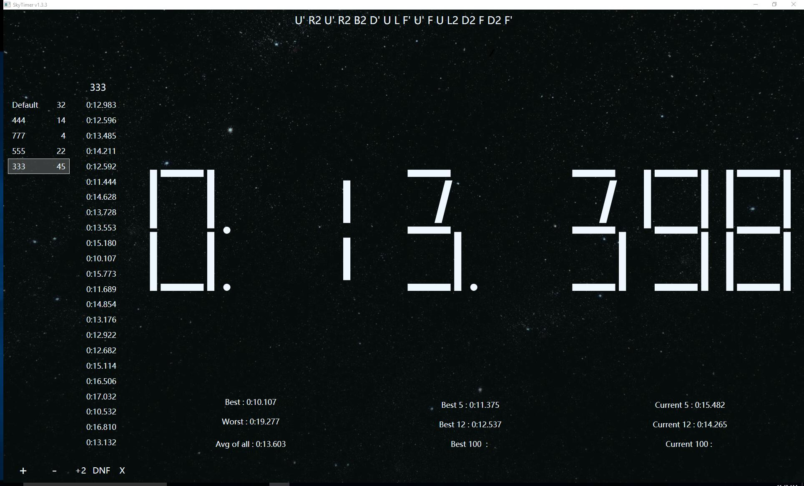
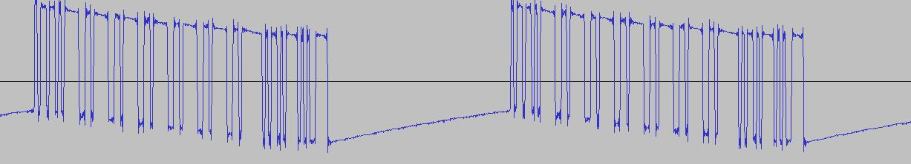

# SkyTimer
支持StackMat和WCA打乱的魔方计时器。

##### MIT License

## 下载链接
- [百度网盘](http://pan.baidu.com/s/1dF7Faff)
- [Github] (https://github.com/GaoSui/SkyTimer/releases)

### 截图

### 系统需求
- 建议Windows 10
- .NET Framwork 4.6.1 [下载链接](https://www.microsoft.com/net/download)
- Java runtime environment [下载链接](http://www.java.com)

### 安装指南
1. 确定已安装.NET Framework 4.6.1和Java。
2. 下载TNoodle (WCA官方打乱程序)并复制到SkyTimer的目录下。 [下载链接](https://www.worldcubeassociation.org/regulations/scrambles/tnoodle/TNoodle-WCA-0.11.1.jar) 
3. 双击SkyTimer.exe运行。TNoodle会被自动启动。

### 使用教程
##### 计时
在计时器数字上右键选择是否使用StackMat。StackMat被禁用时，空格键会被启用。可以选择只显示小数点后两位，但计时器内部始终使用三位。
##### 惩罚
在列表中选择一个成绩，用底部的按钮+2、DNF或删除成绩。
##### 打乱
从打乱下拉菜单中选择打乱种类。"fm"是最少步。 "ni"是无观察项目。
##### 分组
界面左侧是分组列表，使用底部的加减按钮来添加或删除分组。在分组上右键可以清空、重命名或绘制分组。
##### 绘制
在绘制窗口中点daily可以显示本日成绩，拖动进度条选择最近n次或最近n天的成绩。默认显示全部成绩。
##### 统计详情
点击某个统计数据可以查看统计详情。在分组的右键菜单可以设置是否显示打乱。统计详情会被自动复制到剪贴板。
##### 复制打乱
右键某个成绩可以复制它的打乱。
##### 快捷键:
- D: DNF上一成绩
- 2: +2上一成绩
- x: 删除上一成绩
- →: 获取下一打乱

练习数据被保存在SkyTimerData.bin。

##### If you have any problem using SkyTimer, please post it [here](https://github.com/GaoSui/SkyTimer/issues).

### 关于StackMat连接
##### 设置步骤:
1. 在计时器上右键可以打开系统音频设置。
2. 把StackMat设为系统默认录音设备。
3. 把音量调到50。
4. 关闭microphone boost.
5. 禁用所有音效。
6. 确定已启用StackMat模式。

我只用四代表试过。

如果SkyTimer完全没反应，一定是你设置不对或是有没禁用的音效。如果你的声卡自带滤波无法被禁用，StackMat基本不可能正常工作。可以考虑用一个很便宜的usb声卡。

如果SkyTimer有反应但是显示不对，很可能你的StackMat用的是尚未被支持的格式。如果有兴趣破解这个格式，可以联系我。

##### 简单诊断
在计时器上右键选择诊断，SkyTimer会记录10秒的信号到diagnostic.wav文件。用任何音频编辑器打开这个文件，比如Audacity，你可以放大观察波形。 应该是类似这个样子: 
